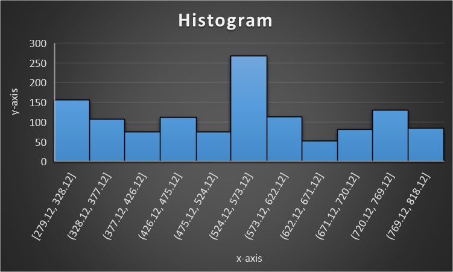
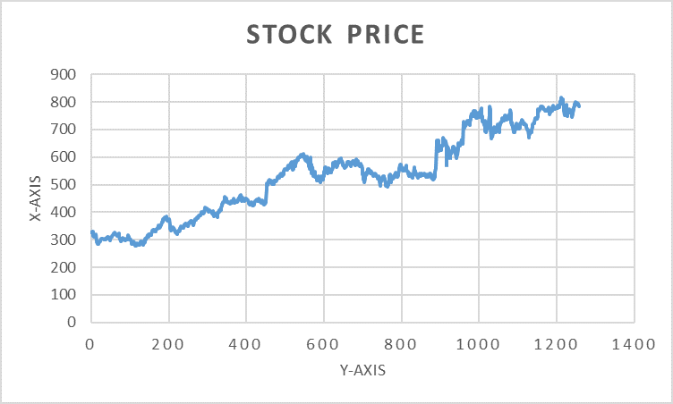

# Recurrent-Neural-Network
Recurrent Neural Network is a generalization of feedforward neural network that has an internal memory. RNN is recurrent in nature as it performs the same function 
for every input of data while the output of the current input depends on the past one computation. After producing the output,
it is copied and sent back into the recurrent network. For making a decision, it considers the current input and the output that it has learned from the previous input.

## Predicted Google stock price 
<b>Dataset<b/>
https://www.kaggle.com/medharawat/google-stock-price 
  
  <table >
    <tr>
       <th></th>
       <th></th>
    </tr>
  </table>
